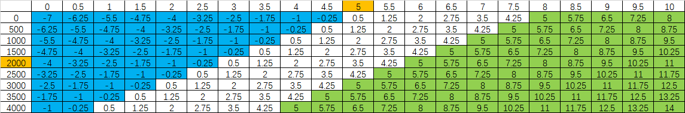
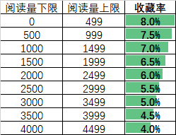
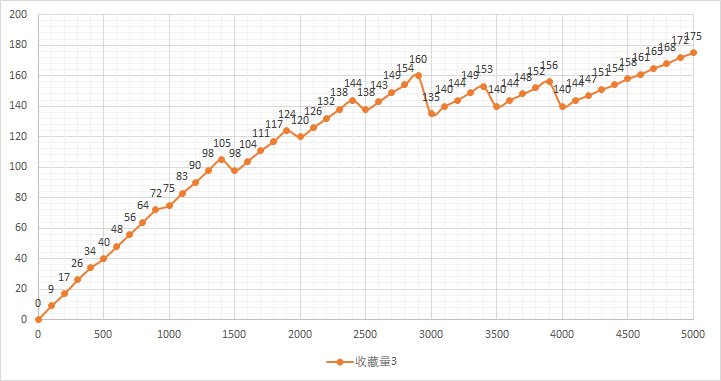

##  推荐指数
### 1.数据获取

从 Pixiv 可获取的数据中，与【众人喜爱的小说】有关的数据有一下三个

- 点击量 - total_view - 小眼睛标志
- 收藏量 - total_bookmarks - 爱心标志
- 评论量 - total_comments - 章末评论

收藏率可由收藏量和点击量进行计算
- 收藏率 =  (收藏量/点击量) x 100%
一般认为收藏率在  5% 以上的，即为一篇优质小说


### 2.数据处理
从上述数据中，计算推荐指数（recommend），达到门槛（推荐指数>=5）后，即可进行推荐

#### 2.1评论量

评论量是一个容易两极分化的数据，（作者与读者进行有效互动，评论量就会很多），有些小说的评论可能会超过30，但更多的甚至都不超过1个  
一般（非作者本人的）评论超过2个，即可认为这是一篇较为优质小说

对评论量取对数（而非取余数），则可以有效避免过多的评论造成的推荐指数过大

`log2(32) = 5` 而 `32/2 = 16`

```
import math

if comments >= 1: # 根据评论量增加推荐指数
	i = math.log2(comments)
	recommend += round(i, 2)
```

#### 2.2点击量与收藏率

下表中，首列为点击量，首行为收藏率，由点击量与收藏率则可以确定相应条件下的推荐指数



比如一篇 ` view=2365, bookmarks=203 即 rate=8.5 ` 的小说，推荐指数为 ` recommend=8.75 `

**基本上符合 Pixiv 用户对优秀的定义**


### 3.最终评定
不同阅读量档位，有其对应的收藏率



不同阅读量乘以不同的收藏率，就有不同的收藏量。达到对应收藏量，即被认为这是一篇较为优秀的小说

下图是阅读量每增加100对应的收藏量




### 4.Q&A
Q1：为什么对阅读量较低的小说的收藏率要求比较高？  
A1：阅读量较低的小说，可能并非主流喜欢的小说  

Q2：为什么对阅读量较高的小说的收藏率要求比较低？  
A2：阅读量较高的小说，基本不可能收藏率过低。从图3可以看出，对阅读量较高的小说的要求也是维持一个较高的水平的。

 

