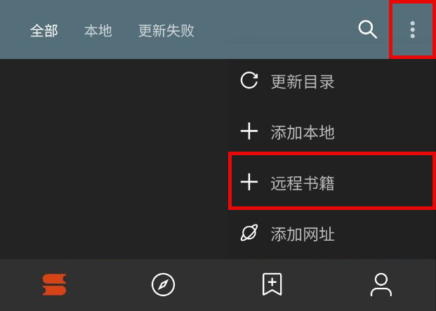
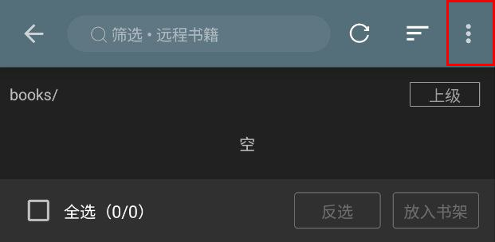
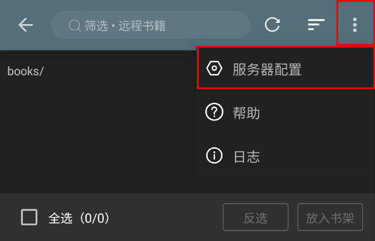
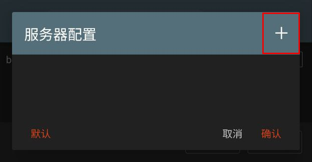
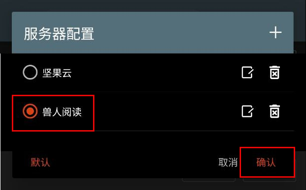
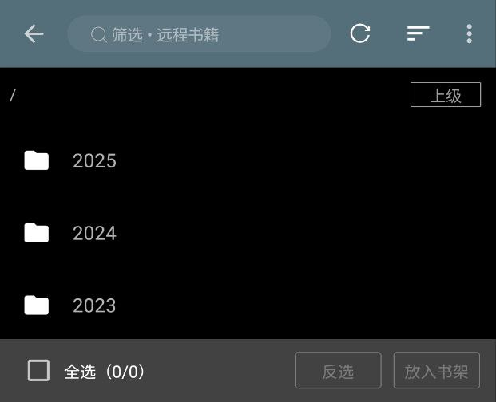
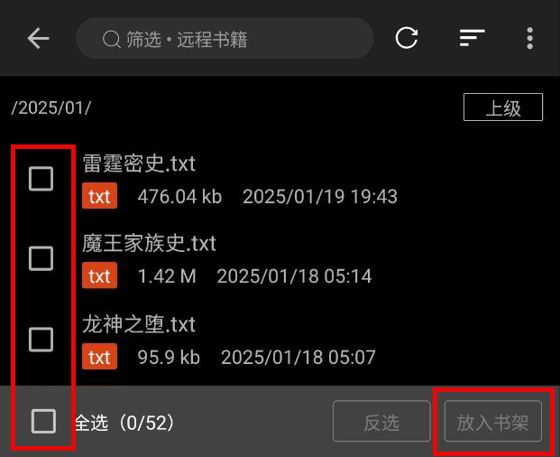

## 远程书籍
### 1.远程书籍配置

书架菜单 - 远程书籍 - 右上角三点菜单 - 服务器配置 - 加号 - 添加服务器配置信息

点击加号，添加服务器配置

填入 Webdav 服务器配置信息

> 地址 `url` 填入 Webdav 服务器地址
>
> 账户 `username` 填入注册邮箱
>
> 密码 `password` 填入 **应用密码（非账户密码）**

保存，选择添加的服务器

刷新，查看文件

选择书籍，放入书架

