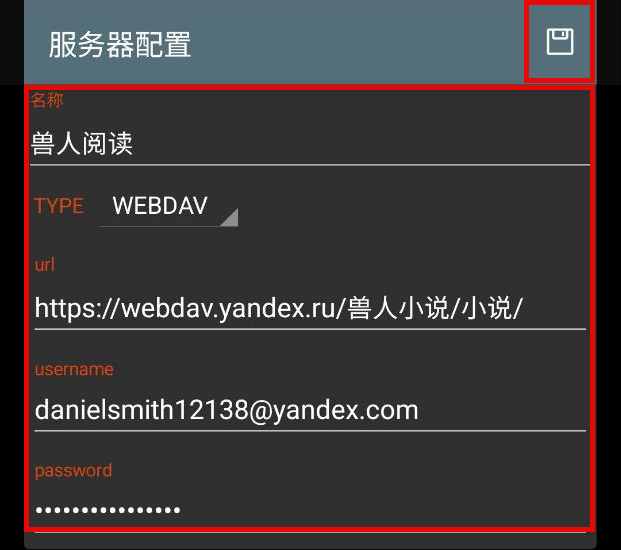

# 三、远程书籍设置

## 1. 远程书籍配置

书架菜单 - 远程书籍 - 右上角三点菜单 - 服务器配置 - 加号 - 添加服务器配置信息

点击加号，添加服务器配置

## 2. 兽人小说服务器配置
| 配置 | 内容                                   |
| --- | -------------------------------------- | 
| 地址 | https://webdav.yandex.ru/兽人小说/小说/ |
| 账户 | danielsmith12138@yandex.com           |
| 密码 | mbatorsztocorhay                      |

填入 Webdav 服务器配置信息，保存

## 3. 查看远程书籍
选择添加的服务器

刷新，查看文件

选择书籍，放入书架

