<div align="center">

# 开源阅读 使用教程 目录
### 本教程由兽人阅读频道 [@FurryReading](https://t.me/FurryReading) 提供
</div>
<br>

| **1. 为什么选择开源阅读？**      | **2. 使用 Linpx 书源**       |
| :---------------------------: | :--------------------------: |
| 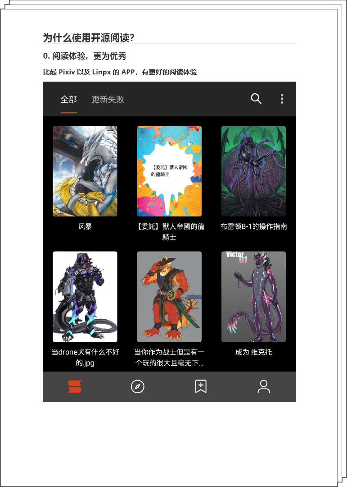　　  | 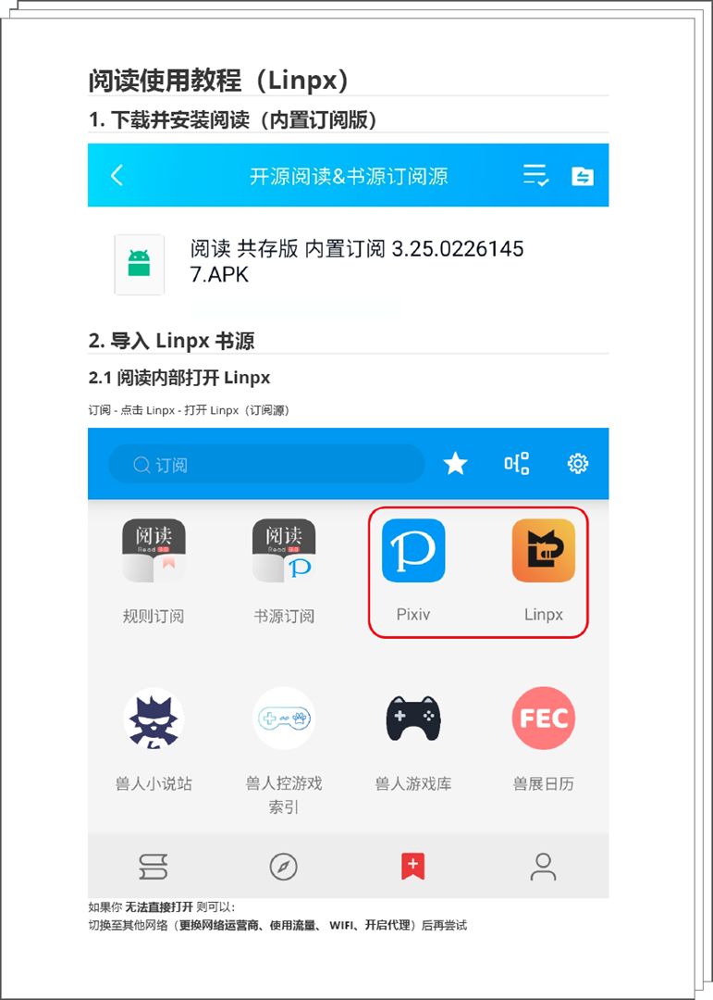　　 |
| **3. 开源阅读远程书籍配置**      | **4. Webdav 备份恢复数据**    |
| 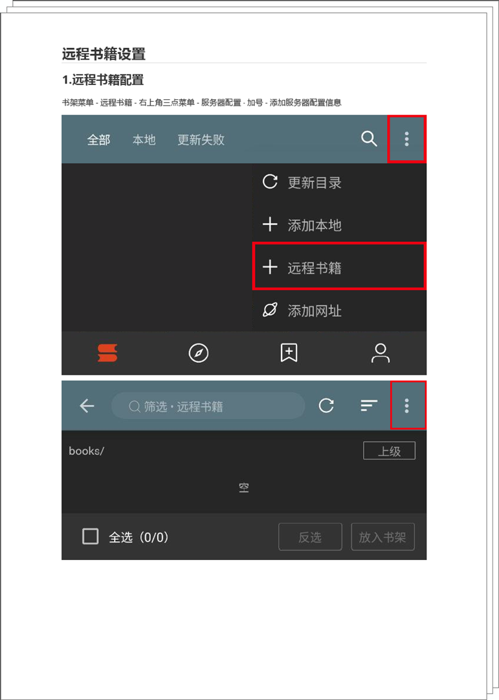   |  |


# 一、为什么使用开源阅读？


## 0. 阅读体验，更为优秀
### 比起 Pixiv 以及 Linpx 的 APP，有更好的阅读体验


## 1. 一个软件，读遍全网
### 导入相关书源，即可阅读相关网站的书籍
- #### Pixiv 相关书源

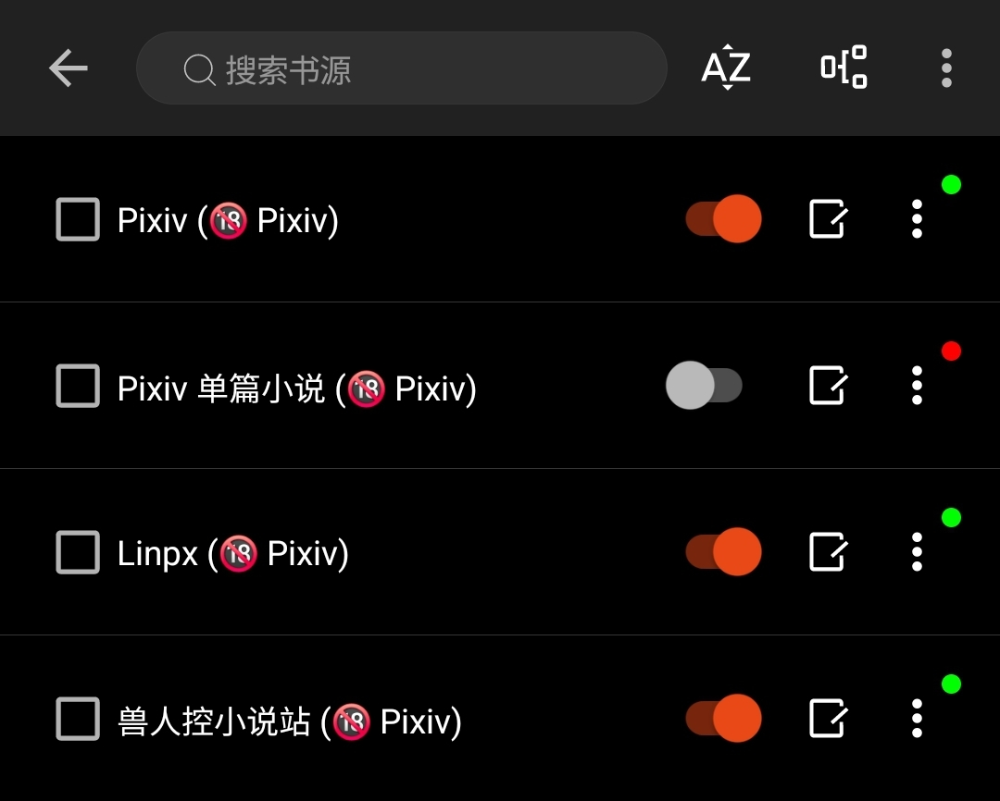
- ### 正版网站书源


- ### 搜索引擎书源


- ### 其他网站书源

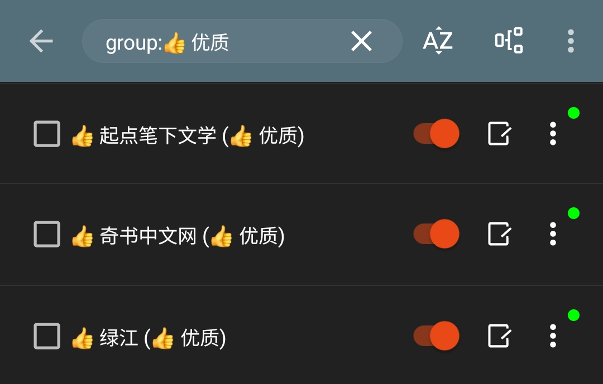


## 2. 书籍换源，便于追更
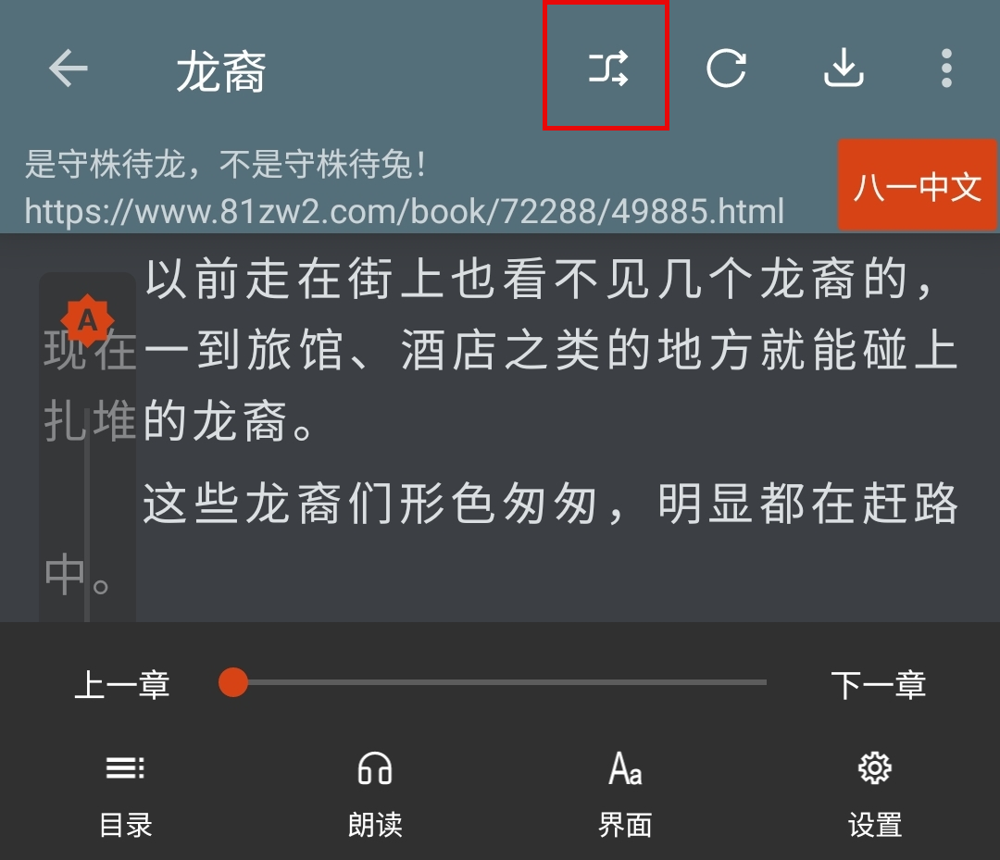


## 3. 远程书籍，自行定义
### 【免代理】追更【兽人阅读频道】推送小说


### 配置后：书架 - 右上角三点菜单 - 远程书籍


### 配置方法：详见 [远程书籍设置](https://github.com/DowneyRem/FurryNovels/blob/main/doc/RemoteBooks.md)
书架菜单 - 远程书籍 - 右上角三点菜单 - 服务器配置 - 加号 - 添加服务器配置信息

| 配置 | 内容                                   |
| --- | -------------------------------------- | 
| 地址 | https://webdav.yandex.ru/兽人小说/小说/ |
| 账户 | danielsmith12138@yandex.com           |
| 密码 | mbatorsztocorhay                      |


## 4. 读书听书，全部支持
- ### 听书-TTS朗读

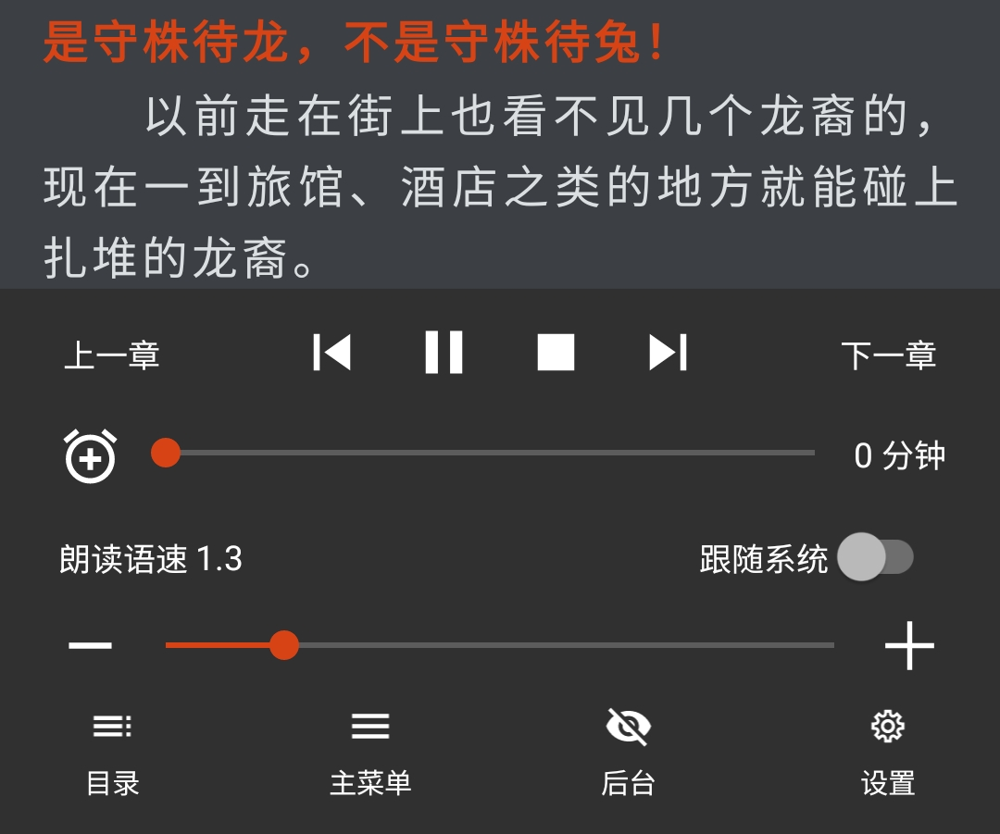
- ### 听书-有声小说


# 二、Linpx 书源 使用教程


## 1. 下载并安装阅读（内置订阅版）


## 2. 导入 Linpx 书源
### 2.1 阅读内部打开 Linpx
订阅 - 点击 Linpx - 打开 Linpx（订阅源）


如果你 **无法直接打开** 则可以：  
切换至其他网络（**更换网络运营商、使用流量、 WIFI、开启代理**）后再尝试


### 2.2 点击按钮【导入书源】，全选，确认


### 2.3 一切大功告成！尽情享受阅读！
## 本篇教程(Linpx 书源)剩余内容均可略过

<br><br>
## 3. 添加小说，尽情使用
### 3.1 发现更多小说


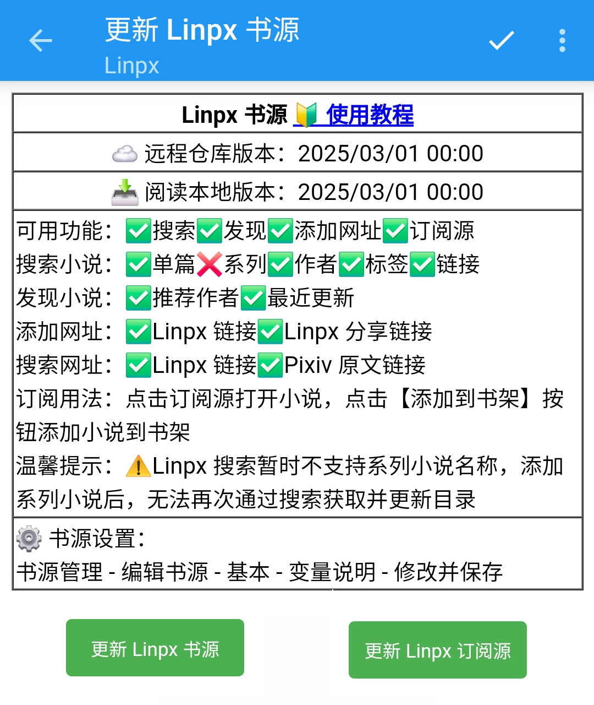


### 3.2 添加网址
书架 - 菜单 - 添加网址 - 粘贴小说链接

可以同时添加多个小说的链接


支持 Linpx 多个格式的网址链接：
```
Linpx 小说长链接
https://furrynovel.ink/pixiv/novel/20063566

Linpx 分享链接
https://furrynovel.ink/pn/20063566

Linpx 分享信息
我正在看唐尼瑞姆创作的《测试页面》一起来看吧！
https://furrynovel.ink/pn/20063566
```


### 3.3 订阅源添加小说
打开 Linpx 小说页面，点击【添加到书架】按钮，即可添加小说到书架


## 4. [故障排查与处理](https://github.com/windyhusky/PixivSource/blob/main/doc/TroubleShoot.md)
### 4.1 图片无法正常显示
#### 解决措施：关闭替换净化


# 三、远程书籍设置
## 1. 远程书籍配置

书架菜单 - 远程书籍 - 右上角三点菜单 - 服务器配置 - 加号 - 添加服务器配置信息


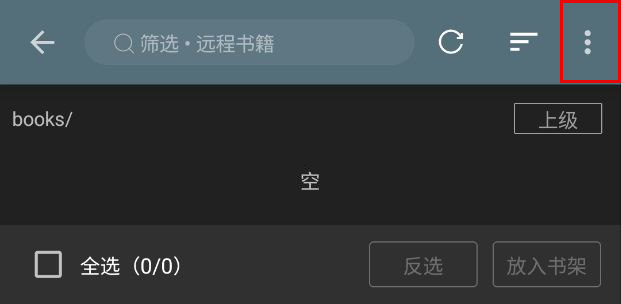


点击加号，添加服务器配置

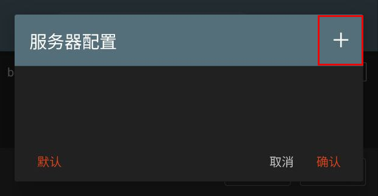


## 2. 兽人小说服务器配置
| 配置 | 内容                                   |
| --- | -------------------------------------- | 
| 地址 | https://webdav.yandex.ru/兽人小说/小说/ |
| 账户 | danielsmith12138@yandex.com           |
| 密码 | mbatorsztocorhay                      |


填入 Webdav 服务器配置信息，保存


## 3. 查看远程书籍
选择添加的服务器


刷新，查看文件


选择书籍，放入书架


# 四、[Webdav 备份与恢复](https://www.yuque.com/legado/wiki/fkx510)
阅读支持 WebDav 云备份，所有支持 WebDav 的云盘都可以用来备份。

建议使用坚果云，每月1G免费流量，备份阅读已经足够了。


## 1. 配置坚果云
### 1.0 [注册并登录坚果云](https://www.jianguoyun.com/d/signup)


### 1.1 [配置坚果云](https://www.yuque.com/legado/wiki/fkx510)

#### 1. 在右上角点击【用户名】，选择【账户信息】


#### 2. 点击【安全选项】后，在第三方管理里【添加应用】


#### 3. 输入名称，点击【生成密码】，最后点击完成


#### 4. 到此 WebDav 账户设置完成


<br><br>
## 2. [设置备份信息](https://www.yuque.com/legado/wiki/mgu5qu)


#### 2.1 进入备份与恢复
主界面 - 我的 - 设置 - 备份与恢复


#### 2.2 设置 WebDav 备份信息
在 WebDav 设置里填入服务器地址、账户、应用密码


#### 2.3 自动备份
完成 WebDav 备份设置后，每次退出APP即会自动备份。

**仅返回式退出会自动备份，任务栏直接关闭不会备份**

**同一天的备份会覆盖，不同日期的备份不会覆盖**


<br><br>
## 3. 备份与恢复数据


### 3.1 手动备份数据
**备份与恢复 - 备份，即可备份数据**

首次备份，请检查坚果云里是否有备份文件。

如果备份失败，请手动在坚果云根目录新建文件夹"legado"，然后再备份


### 3.2 [恢复数据](https://www.yuque.com/legado/wiki/nxs89y)
**备份与恢复 - 恢复**


**选择需要恢复的备份文件**，即可恢复数据
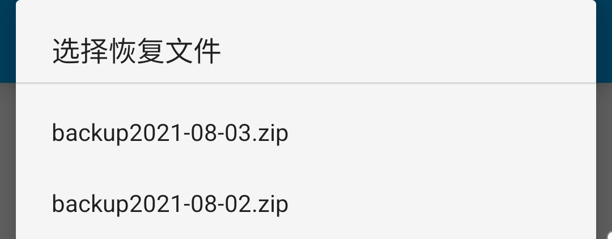


## 本教程由兽人阅读频道 [@FurryReading](https://t.me/FurryReading) 提供
