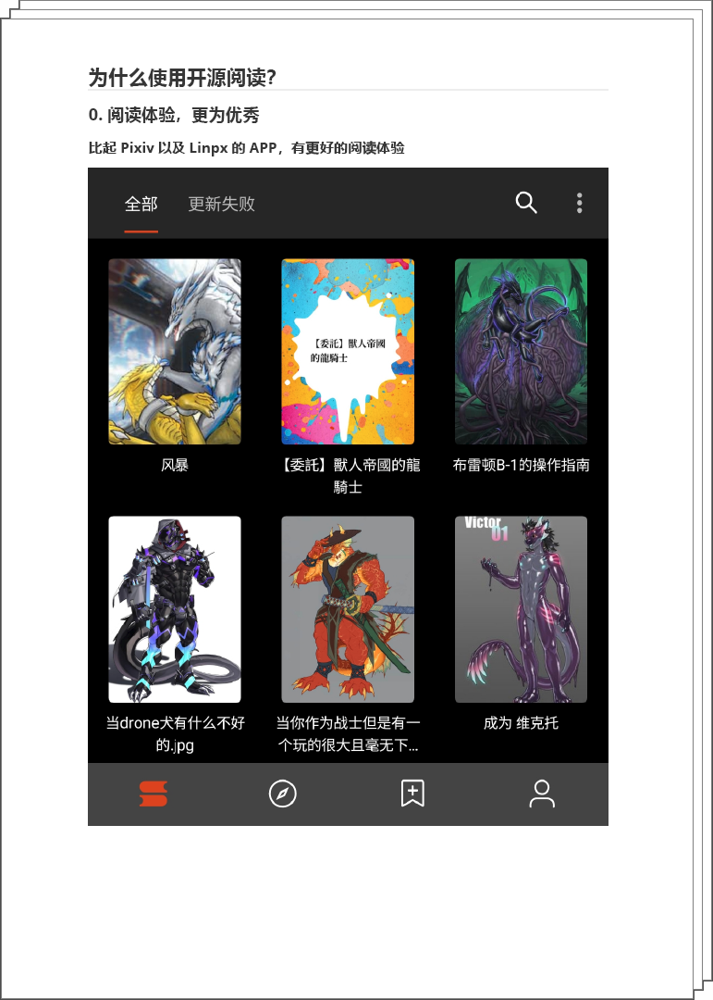
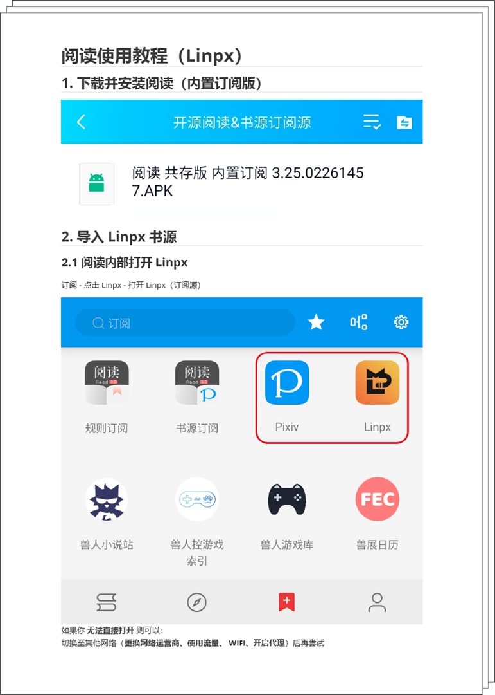
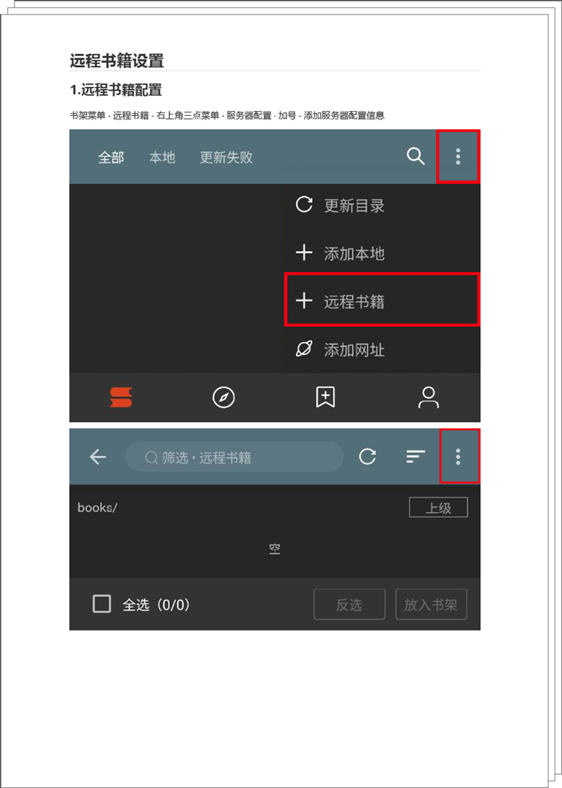

# 开源阅读 使用教程 目录

 

| **1. 为什么选择开源阅读？**　     | **2. 使用 Linpx 书源**　     　 |
| :---------------------------: | :---------------------------: |
| 　　  | 　　　 |
| 　　　　　　　　　　　　　　　　  　| 　　　　　　　　　　　　　　　     |
| **3. 远程书籍配置**　　　　 　    | **4. Webdav 备份恢复数据**　    |
|    |       |
