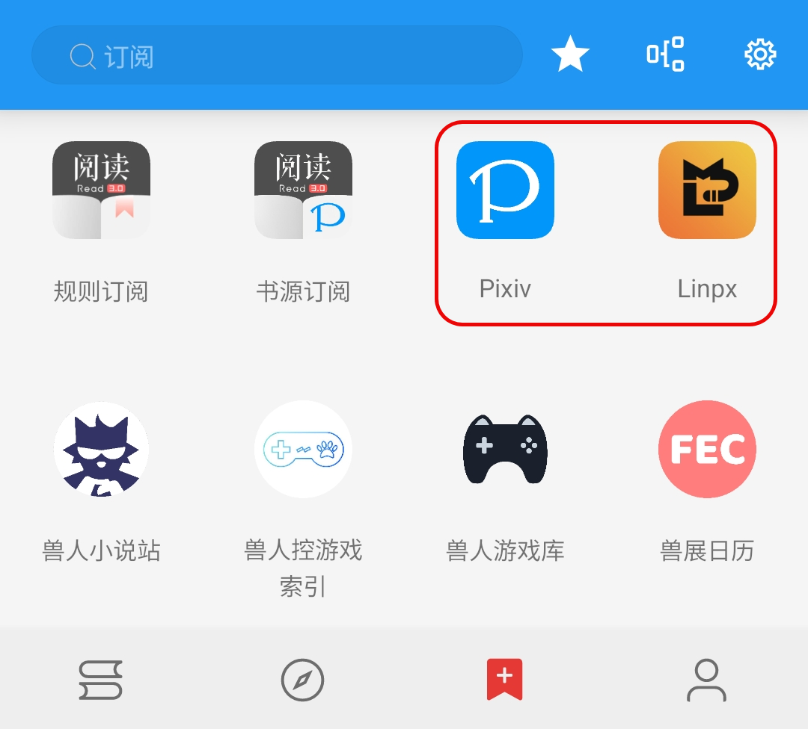
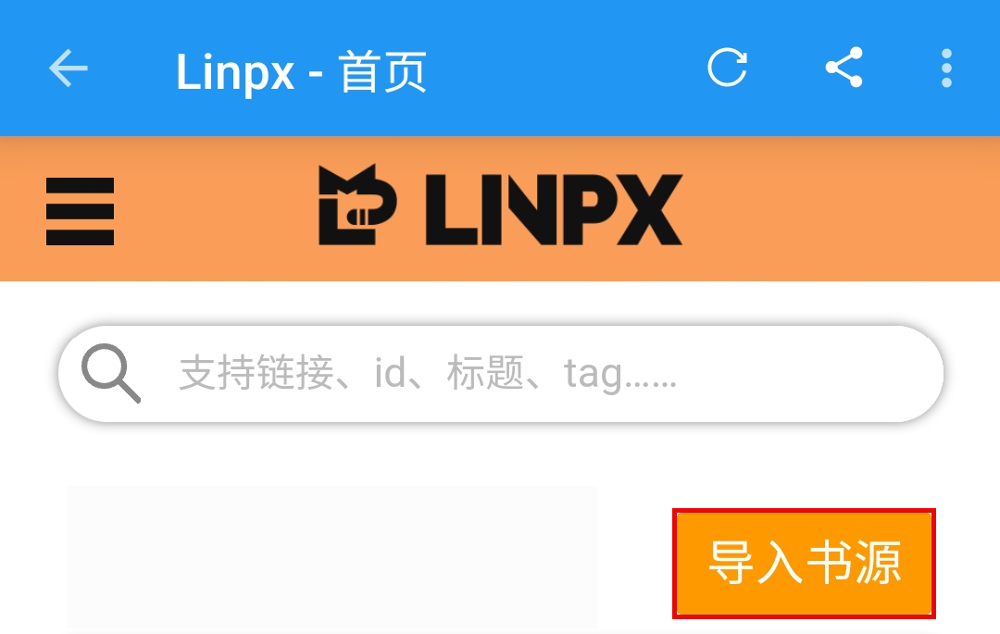
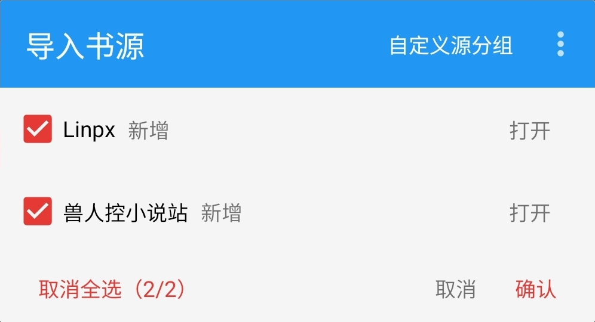
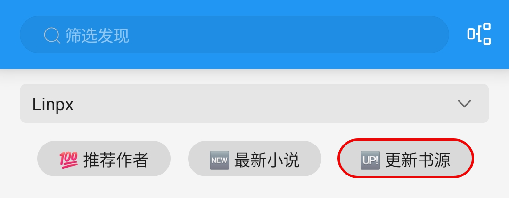
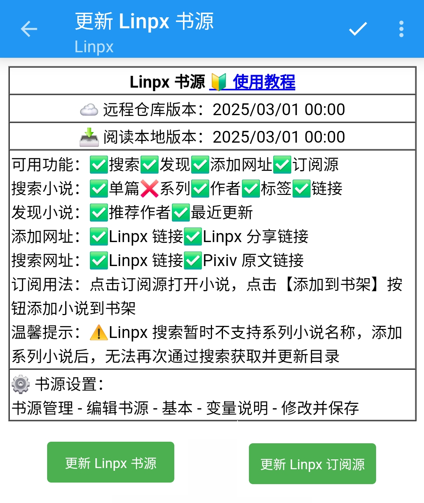
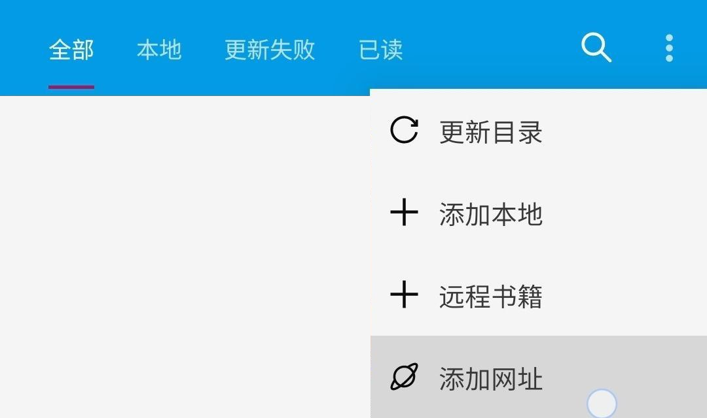
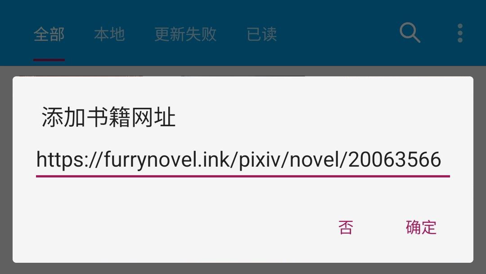
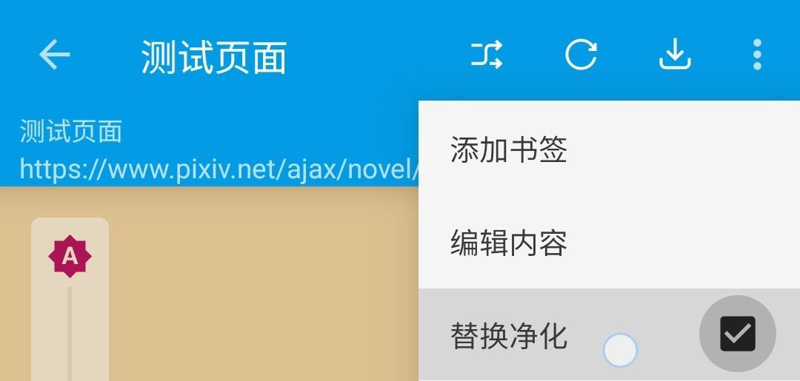

# 阅读使用教程（Linpx）


## 1. 下载并安装阅读（内置订阅版）


## 2. 导入 Linpx 书源
### 2.1 阅读内部打开 Linpx
订阅 - 点击 Linpx - 打开 Linpx（订阅源）


如果你 **无法直接打开** 则可以：  
切换至其他网络（**更换网络运营商、使用流量、 WIFI、开启代理**）后再尝试
  

### 2.2 点击按钮【导入书源】，全选，确认





### 2.3 一切大功告成！尽情享受阅读！
# 以下内容均可略过

<br><br>
## 3. 添加小说，尽情使用
### 3.1 发现更多小说






### 3.2 添加网址
书架 - 菜单 - 添加网址 - 粘贴小说链接 

可以同时添加多个小说的链接



支持 Linpx 多个格式的网址链接：
```
Linpx 小说长链接
https://furrynovel.ink/pixiv/novel/20063566

Linpx 分享链接
https://furrynovel.ink/pn/20063566

Linpx 分享信息
我正在看唐尼瑞姆创作的《测试页面》一起来看吧！
https://furrynovel.ink/pn/20063566
```


### 3.3 订阅源添加小说
打开 Linpx 小说页面，点击【添加到书架】按钮，即可添加小说到书架


## 4. [故障排查与处理](https://github.com/windyhusky/PixivSource/blob/main/doc/TroubleShoot.md)
### 4.1 图片无法正常显示
#### 解决措施：关闭替换净化



## 本教程由兽人阅读频道 [@FurryReading](https://t.me/FurryReading) 提供
