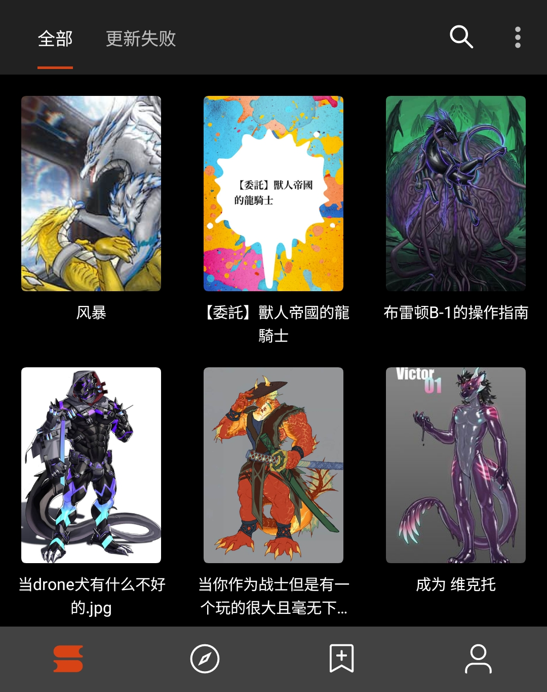
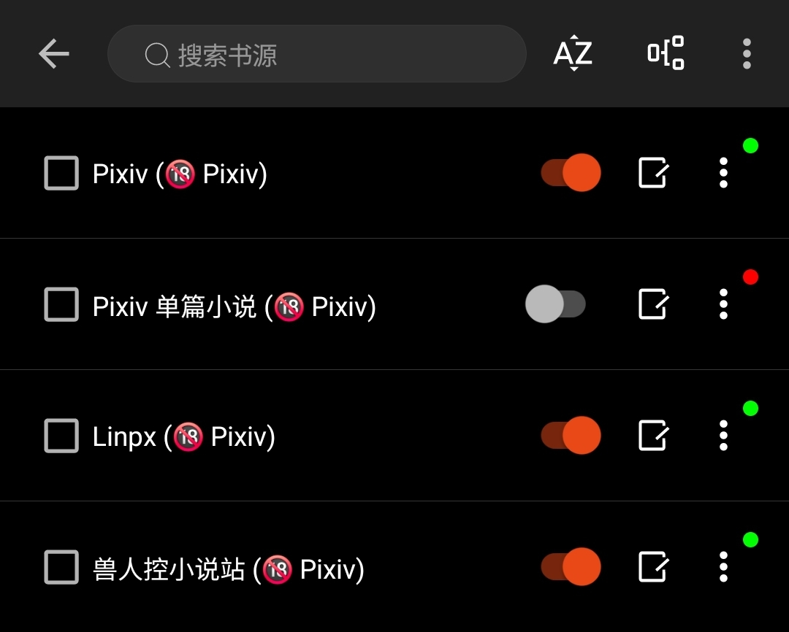
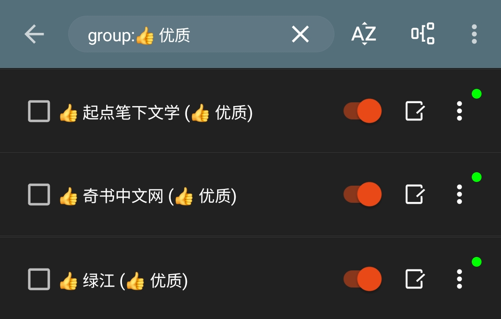
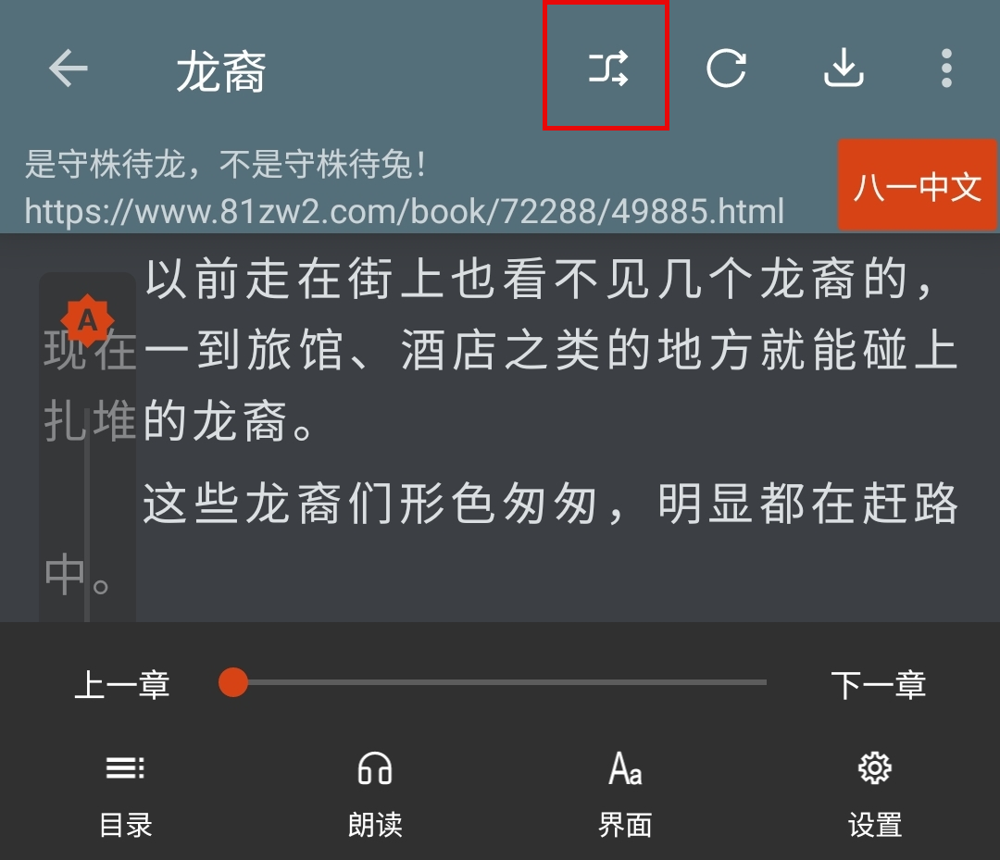
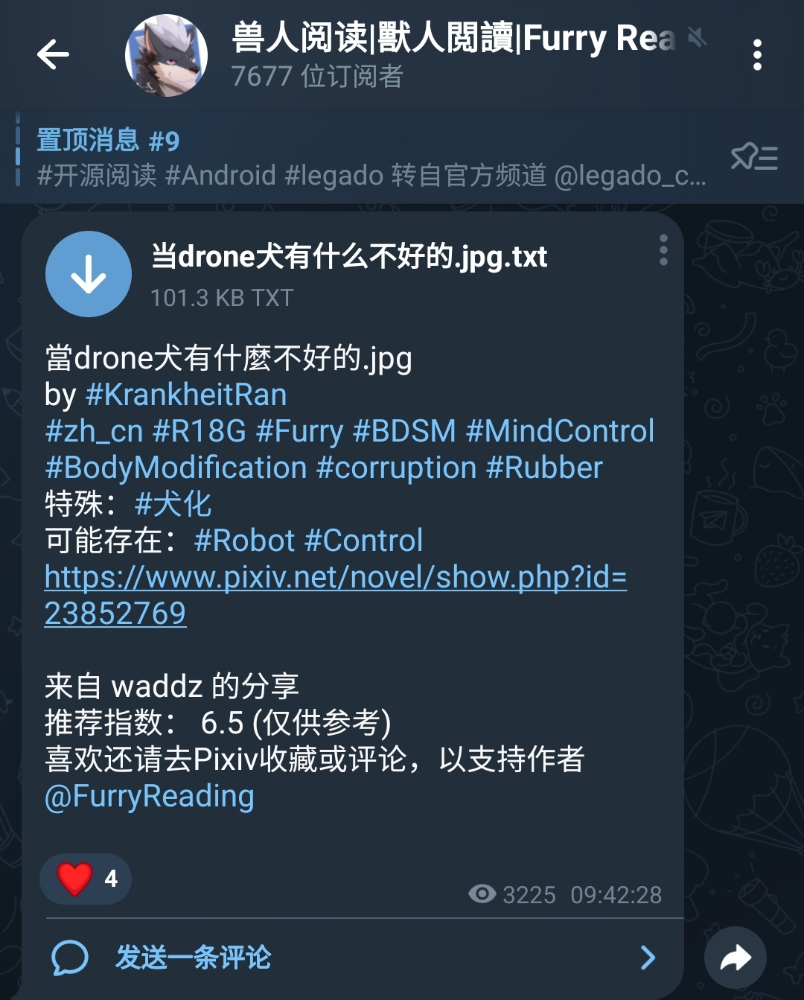
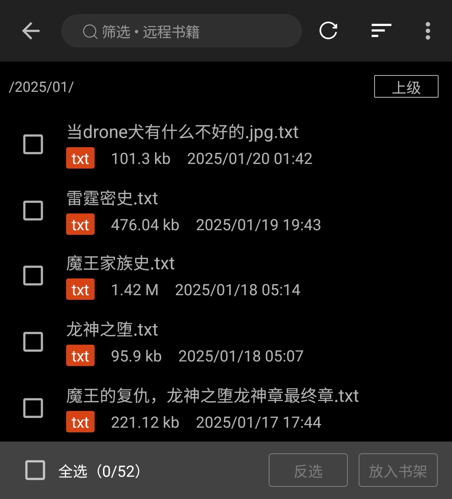
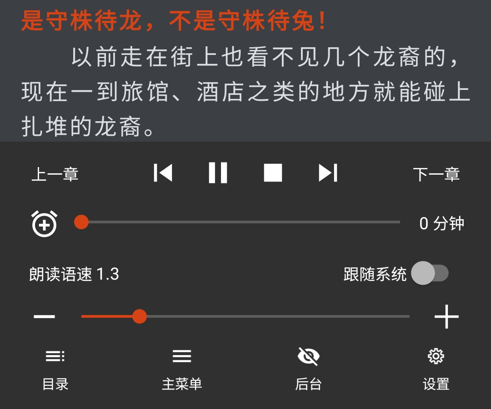
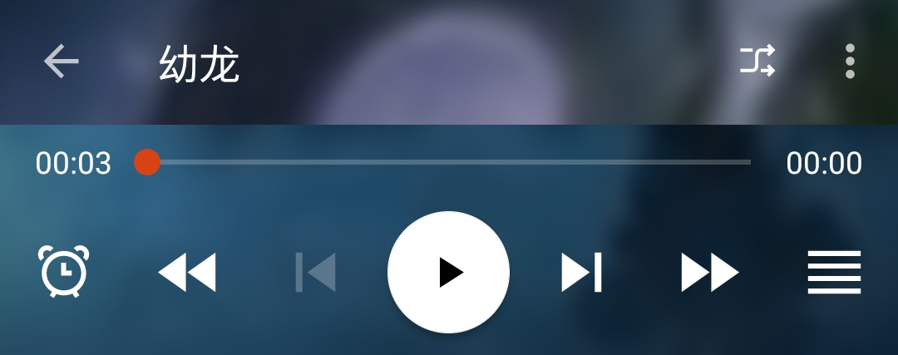

# 一、为什么使用开源阅读？

## 0. 阅读体验，更为优秀
### 比起 Pixiv 以及 Linpx 的 APP，有更好的阅读体验

## 1. 一个软件，读遍全网
### 导入相关书源，即可阅读相关网站的书籍
- #### Pixiv 相关书源

- ### 正版网站书源

- ### 搜索引擎书源

- ### 其他网站书源

## 2. 书籍换源，便于追更

## 3. 远程书籍，自行定义
### 【免代理】追更【兽人阅读频道】推送小说

### 配置后：书架 - 右上角三点菜单 - 远程书籍

### 配置方法：详见 [远程书籍设置](https://github.com/DowneyRem/FurryNovels/blob/main/doc/RemoteBooks.md)
书架菜单 - 远程书籍 - 右上角三点菜单 - 服务器配置 - 加号 - 添加服务器配置信息

| 配置 | 内容                                   |
| --- | -------------------------------------- | 
| 地址 | https://webdav.yandex.ru/兽人小说/小说/ |
| 账户 | danielsmith12138@yandex.com           |
| 密码 | mbatorsztocorhay                      |

## 4. 读书听书，全部支持
- ### 听书-TTS朗读

- ### 听书-有声小说

# 如何下载并使用开源阅读？
# 详见：[阅读使用教程（太长不看版）](https://github.com/windyhusky/PixivSource/blob/main/doc/TooLongToRead.md)